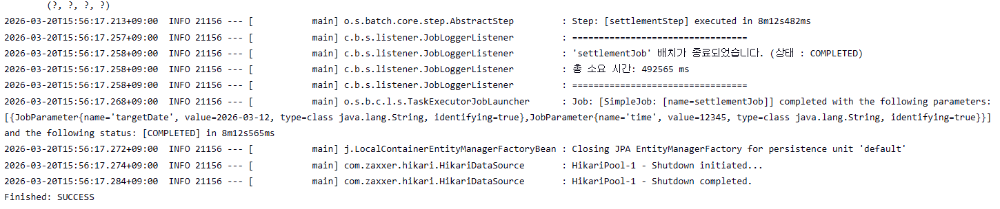

# Settlement Batch Project

Spring Batch와 Spring Data JPA를 사용해 주문 데이터를 정산 데이터로 변환하는 정산 시스템 예제 프로젝트입니다.  
MySQL을 저장소로 사용하며, 배치 잡이 특정 날짜의 주문을 조회한 뒤 수수료를 제외한 정산 금액을 계산해서 `Settlement` 테이블에 적재합니다.

## 프로젝트 개요

이 프로젝트는 주문(`Orders`)과 정산(`Settlement`)을 분리해 관리하는 정산 배치 흐름을 구현합니다.

- `Orders` 테이블에서 대상 주문을 조회합니다.
- 주문 금액의 3%를 수수료로 계산합니다.
- 수수료를 제외한 정산 금액을 생성합니다.
- 계산 결과를 `Settlement` 테이블에 저장합니다.

핵심 구현은 청크 기반 Spring Batch 잡으로 구성되어 있으며, 한 번에 1000건씩 읽고 처리하도록 설정되어 있습니다.

## 기술 스택

- Java 21
- Spring Boot 4.0.3
- Spring Batch JDBC
- Spring Data JPA
- MySQL
- Gradle
- Lombok

## 도메인 모델

### Orders

주문 원본 데이터를 표현합니다.

- `id`: 주문 ID
- `customerName`: 주문자명
- `storeName`: 가맹점명
- `amount`: 주문 금액
- `orderDate`: 주문일

### Settlement

정산 결과 데이터를 표현합니다.

- `id`: 정산 ID
- `orderId`: 원본 주문 ID
- `storeName`: 가맹점명
- `settlementAmount`: 수수료를 제외한 정산 금액
- `settlementDate`: 정산 처리일

## 프로젝트 구조

```text
src/main/java/com/batch/settlement
├─ SettlementApplication.java
├─ domain
│  ├─ Orders.java
│  └─ Settlement.java
├─ job
│  └─ SettlementJobConfig.java
├─ listener
│  └─ JobLoggerListener.java
└─ scheduler
   └─ JobScheduler.java
```

## 배치 처리 흐름

배치 잡 이름은 `settlementJob`이며, 내부적으로 `settlementStep` 하나를 사용합니다.

### 1. Reader

`JpaPagingItemReader`가 `targetDate` 잡 파라미터를 기준으로 주문 데이터를 조회합니다.

조회 조건:

- `Orders.orderDate = targetDate`
- `id` 오름차순 정렬

### 2. Processor

주문 1건당 다음 규칙으로 정산 금액을 계산합니다.

- 수수료: `amount * 0.03`
- 정산 금액: `amount - fee`

계산 결과는 새로운 `Settlement` 엔티티로 변환됩니다.

### 3. Writer

`JpaItemWriter`를 사용해 정산 결과를 데이터베이스에 저장합니다.

## 배치 실행 방식

프로젝트 내부에는 `JobScheduler` 클래스와 매일 오전 4시에 실행하는 크론 설정이 포함되어 있습니다.

```java
@Scheduled(cron = "0 0 4 * * *")
```

스케줄러가 실행되면 `targetDate`를 `현재 날짜 - 7일`로 설정해 배치를 시작하도록 작성되어 있습니다.

실제 운영 관점에서는 애플리케이션 내부 스케줄러를 상시 구동하는 대신 Jenkins를 사용해 배치를 실행하는 방식으로 활용할 수 있습니다. 이 프로젝트도 Jenkins를 통해 배치 실행 결과를 확인하는 형태로 운영되며, Jenkins가 배치 실행 트리거 역할을 맡습니다.

즉, 코드 안에는 스케줄러 예제가 포함되어 있지만 실제 배치 실행 주체는 Jenkins라고 이해하면 됩니다.

## Jenkins 활용

이 프로젝트는 Jenkins를 사용해 정산 배치를 실행하는 방식으로 운영할 수 있습니다.

- Jenkins가 배치 실행 시점을 제어합니다.
- 잡 실행 시 `targetDate` 같은 파라미터를 전달해 정산 대상일을 지정할 수 있습니다.
- 실행 결과는 Jenkins 콘솔 로그에서 확인할 수 있습니다.

배치가 정상 종료되면 `settlementJob`이 `COMPLETED` 상태로 기록되고, 전체 수행 시간과 전달된 파라미터가 함께 출력됩니다.

## Jenkins 실행 결과

아래 이미지는 Jenkins를 통해 배치를 실행한 뒤 성공적으로 종료된 로그입니다.

[Jenkins batch 결과]

## 현재 구현 포인트

- Spring Batch의 Reader / Processor / Writer 기본 구성을 이해하기 좋은 구조
- JPA 기반으로 주문과 정산 데이터를 다루는 예제
- Job 실행 전후 로그를 남기는 `JobLoggerListener` 포함
- 정산 계산 로직을 Processor에 분리

## 보완하면 좋은 부분

- 중복 정산 방지 전략 추가
- 수수료율, 실행 대상일 등을 설정값으로 분리

## 참고 파일

- [README.md](C:/Users/ghktk/study/settlement/README.md)
- [SettlementJobConfig.java](C:/Users/ghktk/study/settlement/src/main/java/com/batch/settlement/job/SettlementJobConfig.java)
- [JobScheduler.java](C:/Users/ghktk/study/settlement/src/main/java/com/batch/settlement/scheduler/JobScheduler.java)
- [SettlementApplication.java](C:/Users/ghktk/study/settlement/src/main/java/com/batch/settlement/SettlementApplication.java)
- [application.yaml](C:/Users/ghktk/study/settlement/src/main/resources/application.yaml)
